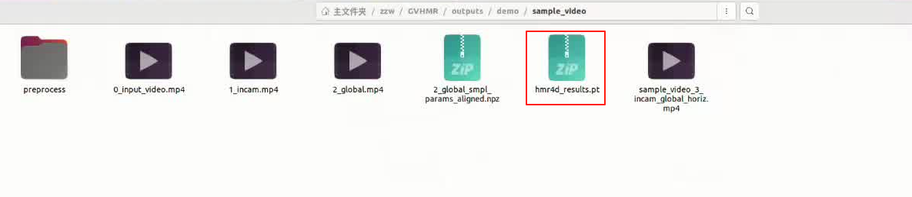

# Video2Mimic: GVHMR+GMR - 单目视频转换为宇树G1机器人重定向动作数据
> **注意：此版本是基于 GVHMR和GMR两个项目之上，优化的单目视频机器人动作重定向流程。**

**最后更新：2026年4月24日**

增加功能：
- video_editing.py 视频裁减工具；
- gvhmr2robot_fix.py 自动解决脚部悬空；
- gvhmr2robot_fix.py 自动在原始动作前后加入默认站立姿态，并平滑过渡，可选过渡帧数；
- gvhmr2robot_fix.py 加入G1 23dof版本的重定向；
- gvhmr2robot_fix.py 支持自定义起始和结束默认姿态的面朝方向角度（通过 --default_facing_angle 参数）【2026-04-24】；
- gvhmr2robot_fix.py 改进平滑过渡算法，使用SLERP进行四元数插值，防止足部离地【2026-04-24】；
- gvhmr2robot_fix.py 添加安全根部高度检测，防止蹲下姿态时穿过地面【2026-04-24】。

## 一、GVHMR 视频转动作数据

安装及环境配置参照https://github.com/zju3dv/GVHMR/

**视频转换数据**

```bash
python tools/demo/demo.py --video=docs/example_video/tennis.mp4 -s
```

 其中，--video=/path/to/video，为输入（即需要处理）的视频路径



## 二、GMR 动作重定向

安装和环境配置参照https://github.com/YanjieZe/GMR

**将数据转换重定向，并转换成csv格式**

```bash
python scripts/gvhmr_to_robot.py --gvhmr_pred_file <path_to_hmr4d_results.pt> --robot unitree_g1 --record_video --save_path motions/G1/G1.pkl
```

其中，--gvhmr_pred_file就是上面GVHMR生成的pt文件的路径，--save_path为转化出来的pkl的保存路径。

转换成功之后，会进行数据重定向视频播放，注意观察重定向效果。

```bash
python scripts/batch_gmr_pkl_to_csv.py --folder /home/.../GMR/motions/G1/
```

其中，--folder为pkl保存的文件夹路径。

## 三、Beyondmimmic 强化学习动作跟踪

安装和环境配置参照https://github.com/HybridRobotics/whole_body_tracking

也可以使用我的仓库https://github.com/Kennyp-Chen/BeyondMimic_Hero. 其中包含了G1 23dof 版本的Train\Play代码，并且可以使用tensorboard进行训练过程的可视化，无需wandb注册也可以训练。

## 四、 Sim2Real

参考Robojudo ： https://github.com/HansZ8/RoboJuDo 

## Acknowledgement

感谢以下项目提供的技术参考和代码实现：

- [GVHMR](https://github.com/yzqin/gvhmr)
- [GMR](https://github.com/YanjieZe/GMR)
- [BeyondMimic](https://github.com/HybridRobotics/whole_body_tracking)
- [RoboJuDo](https://github.com/HansZ8/RoboJuDo)
- [G1-Imitation-Learning-Pipeline](https://github.com/Peter-QY/G1-Imitation-Learning-Pipeline)
